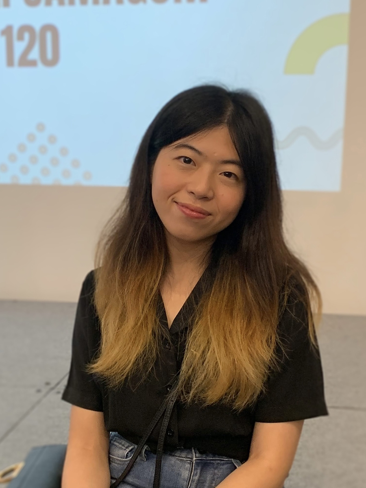

<h1> Members of IDEA Lab </h1>

  

    

      
      

        <h4>Ajit Panesar</h4>
        
Head of IDEA Lab

        
(2017-Present)

        

        <a href="mailto:a.panesar@imperial.ac.uk" target = "_blank">
          <button class="button">Contact</button>
        </a>
        

      

    

  

  

    

      
      

        <h4>Saeed Zare Chavoshi</h4>
        
Post Doctoral Research Associates

        
(2021-Present)

        

        <a href="mailto:s.zare@imperial.ac.uk" target = "_blank">
          <button class="button">Contact</button>
        </a>
        

      

    

  

  

    

      
      

        <h4>János Plocher</h4>
        
PhD Researcher

        
(2017-Present)

        

        <a href="mailto:janos.plocher16@imperial.ac.uk" target = "_blank">
          <button class="button">Contact</button>
        </a>
        

      

    

  

  

    

      
      

        <h4>Yingwei Hou</h4>
        
PhD Researcher

        
(2017-Present)

        

        <a href="mailto:XXXXXX" target = "_blank">
          <button class="button">Contact</button>
        </a>
        

      

    

  

  

    

      
      

        <h4>Amber Wang</h4>
        
PhD Researcher

        
(2020-Present)

        

        <a href="mailto:a.wang20@imperial.ac.uk" target = "_blank">
          <button class="button">Contact</button>
        </a>
        

      

    

  

  

    

      
      

        <h4>Bohan Peng</h4>
        
PhD Researcher

        
(2021-Present)

        

        <a href="mailto:bohan.peng16@imperial.ac.uk" target = "_blank">
          <button class="button">Contact</button>
        </a>
        

      

    

  

  

  

    

      
      

        <h4>Piyapat Jameekornkul</h4>
        
PhD Researcher

        
(2021-Present)

        

        <a href="mailto:piyapat.jameekornkul20@imperial.ac.uk" target = "_blank">
          <button class="button">Contact</button>
        </a>
        

      

    

  

<h2> Alumni </h2>

  

    

      
      

        <h4>Chanhui Lee</h4>
        
PhD alumnus

        
(2017-2021)

        

        <a href="mailto: " target = "_blank">
          <button class="button">Contact</button>
        </a>
        

      

    

  

  <!-- 

    

      
      

        <h4>Marie Ross</h4>
        
PhD alumna

        
(20XX-20XX)

        

        <a href="mailto: " target = "_blank">
          <button class="button">Contact</button>
        </a>
        

      

    

  
 -->

