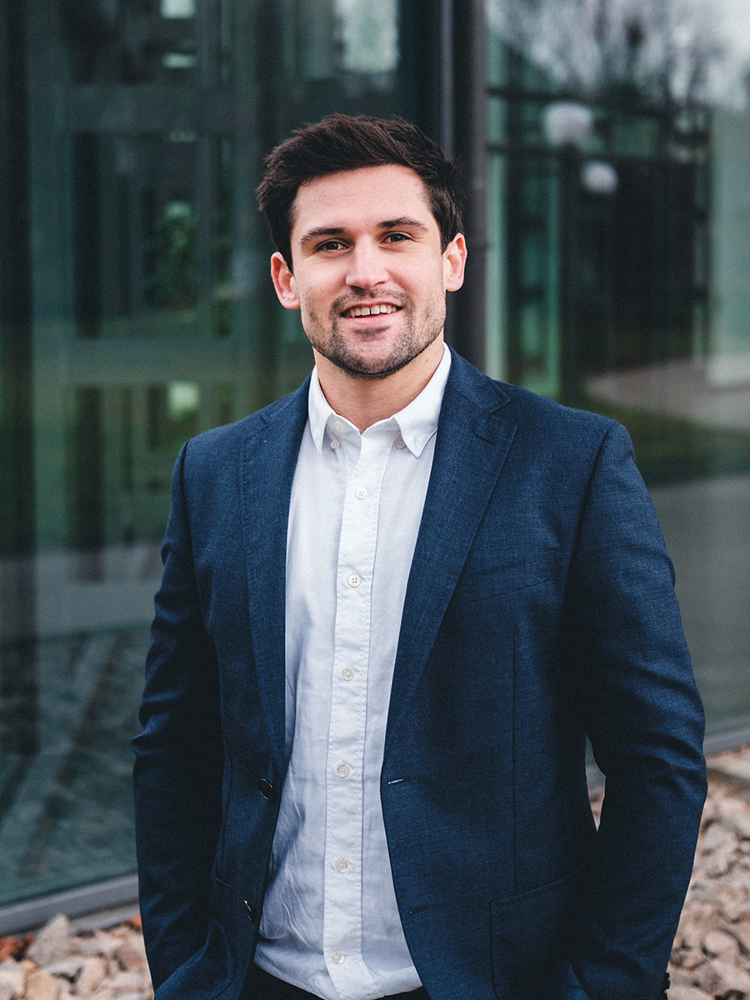
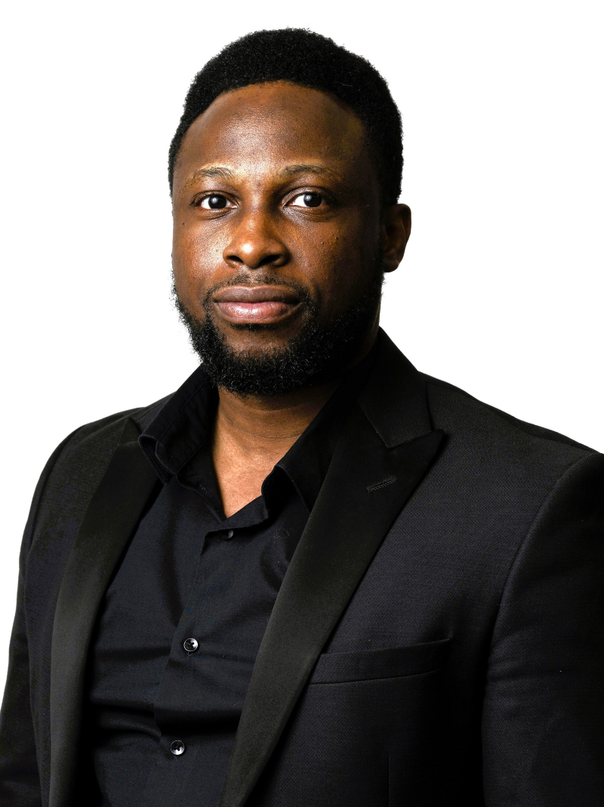

<h1> Members of IDEA Lab </h1>
<!-- Add icon library -->
<link rel="stylesheet" href="https://cdnjs.cloudflare.com/ajax/libs/font-awesome/4.7.0/css/font-awesome.min.css">

<h2> Head of Group </h2>
<h3 id="ajit"> Dr Ajit PANESAR </h3>
<a href="https://www.linkedin.com/in/ajit-panesar-bb986540/" style="text-decoration: none;" title="LinkedIn" class="btn btn-linkedin btn-lg" target = "_blank"><i class="fa fa-linkedin fa-fw"></i> LinkedIn</a>
<a href="https://scholar.google.com/citations?user=owqDRlUAAAAJ&hl=en&oi=ao" style="text-decoration: none;" title="Google" class="Google" target = "_blank"><i class="fa fa-google fa-fw"></i> Google Scholar</a>
<!-- <a href="https://www.researchgate.net/profile/Janos-Plocher" style="text-decoration: none;" title="researchGate" class="researchGate" target = "_blank"> Research Gate</a> -->

  

    <figure>
        
    </figure>
  

  

  

<b>Mission</b>: 

* Exploit machine learning (ML) and optimisation techniques to address the engineering needs of aerospace/auto/bio/energy/renewable sector.
* Design for digital fabrication technologies, such as, additive manufacturing (AM).
* Help inspire, train and nurture the next generation of workforce.

<b>Profile</b>: 

Ajit is an Associate Professor (Reader) in Computational Design for Advanced Manufacturing at Imperial College London, with a leading track record in <a style = "white-space:nowrap;" href="https://www.sciencedirect.com/science/article/pii/S2214860420305431">additive manufacturing</a>, <a style="white-space:nowrap;" href="https://www.sciencedirect.com/science/article/pii/S2214860422006273">topology optimisation and ML</a> (incl. <a style = "white-space:nowrap;" href="https://www.sciencedirect.com/science/article/pii/S221486042400544X">Scientific ML</a>) and architected materials. He has authored the “<a style = "white-space:nowrap;" href="https://dl.asminternational.org/handbooks/edited-volume/187/chapter-abstract/3741931/Simulation-Driven-Design-and-the-Role-of?redirectedFrom=fulltext">Simulation-Driven Design</a>” chapter for the <a style="white-space:nowrap;" href="https://doi.org/10.31399/asm.hb.v24A.a0006950">ASM Handbook</a> bridging the gap between research and practice, and contributed to over 60 publications, with several making it to the most downloaded/cited list. He co-leads the “Theory, Modelling and AI” SIG within the <a style="white-space:nowrap;" href="https://metamaterials.network/focus-areas/theory-modelling-and-ai/">EPSRC UK Metamaterials Network</a>, and led the “Computational Tools” theme in the <a style="white-space:nowrap;" href="https://www.designforam.ac.uk/research/">EPSRC DfAM network</a>. Ajit is actively engaged in multiple collaborations aimed at advancing the state of the art and delivering tangible impact across a wide range of sectors. He has successfully secured research funding from both research councils and industry partners to deliver on his research vision. Importantly, he is extremely grateful for all the support he receives – from the members of IDEA lab, his colleagues/collaborators, mentors, funders and the wider community!

<b>Something more about me</b>: loves to solve puzzles and is trained in a few martial arts (Brazilian Jiu Jitsu, Wing Chun)
  

  

<!-- ----------------------------------------- -->
<!-- <h2> Research Associates/Assistants </h2> -->

<!-- ------------------------------ -->
<h2> PhD Students </h2>
<h3 id="bohan"> Mr Bohan PENG </h3>
<!-- <a href="https://www.linkedin.com/in/bohan-peng-573724147?lipi=urn%3Ali%3Apage%3Ad_flagship3_profile_view_base_contact_details%3B%2BWE3htgqQReLi0wGtMulFQ%3D%3D" style="text-decoration: none;" title="LinkedIn" class="btn btn-linkedin btn-lg" target = "_blank"><i class="fa fa-linkedin fa-fw"></i> LinkedIn</a> -->
<a href="https://www.linkedin.com/in/bohan-peng-573724147/" style="text-decoration: none;" title="LinkedIn" class="btn btn-linkedin btn-lg" target = "_blank"><i class="fa fa-linkedin fa-fw"></i> LinkedIn</a>

  

    <figure>
        
    </figure>
  

  

  

<b>Research Aim</b>: Improve the rate of first-time-right for additive manufacturing (AM) through the use of machine learning (ML) techniques. 

<b>Objectives</b>: 

* To investigate the effectiveness of ML-based techniques in generating designs for AM
* To realise the transformation of ML from black-box to grey-box with scientific machine learning approaches
* To develop ML-based methods alternative to the current numerical AM simulation methods that are less time-consuming, enabling the subsequent design optimisation that is manufacturing-aware

 <b>Short scientific description</b> (click to expand) 

One main endeavour for realising the goals of the project is shifting the ML methods away from the traditional ‘black-box’ nature. The application of the ‘physics-based machine learning’ (PBML) concept is identified as a viable means for the objective. In addition to the development of physics-informed machine learning models, another focus is the integration of trained ML models with traditional numerical methods to leverage the strength of both techniques for multi-scale, high-fidelity, and rapid simulation as well as design optimisation. 

<b>Something more about me</b>: Aviation geek, UK CAA PPL(A) holder

  

  

<h3 id="pat"> Ms Piyapat JAMEEKORNKUL (Pat) </h3>
<a href="https://th.linkedin.com/in/piyapat-jameekornkul-861670175" style="text-decoration: none;" title="LinkedIn" class="btn btn-linkedin btn-lg" target = "_blank"><i class="fa fa-linkedin fa-fw"></i> LinkedIn</a>
<!-- <a href="#" style="text-decoration: none;" title="Twitter" class="twitter" target = "_blank"><i class="fa fa-twitter fa-fw"></i> Tweet</a> -->

  

    <figure>
        
    </figure>
  

  

  

<b>Research Aim</b>: Innovative design framework to elevate the mechanical properties for fibre-reinforced AM, integrating cellular structure and bio-inspired strategies.

<b>Objectives</b>: 

* To explore and utilise the nature-inspired approaches in design for AM to enhance the mechanical properties
*	To investigate the plastic behaviour and failure characteristics of fibre-reinforced and metallic lattice structures fabricated by AM under dynamic loading conditions
*	To explore innovative composite manufacturing processes and apply them to create structures for energy absorption

 <b>Short scientific description</b> (click to expand) 

Known for their notable properties such as specific energy absorption and impact resistance, nature-inspired structures like cellular and hierarchical forms have been utilised for Additive Manufacturing (AM). Through experimental investigation, my objective is to explore structural design options and material variations, such as composites, to enhance energy absorption during a crash and thereby expand AM capabilities through innovative design. This work also seeks to provide insight into the dynamic behaviour of AM parts and broaden the adoption of AM in crashworthiness applications.

<b>Something more about me</b>: Exploring cool art exhibition and local cuisine 

  

  

<h3 id="shimeng"> Ms Shimeng QIAN </h3>
<a href="https://www.linkedin.com/in/shimeng-qian-4698aa237/" style="text-decoration: none;" title="LinkedIn" class="btn btn-linkedin btn-lg" target = "_blank"><i class="fa fa-linkedin fa-fw"></i> LinkedIn</a>
<!-- <a href="#" style="text-decoration: none;" title="Twitter" class="twitter" target = "_blank"><i class="fa fa-twitter fa-fw"></i> Tweet</a> -->

  

    <figure>
        
    </figure>
  

  

  

<b>Research Aim</b>: Development and demonstration of structural power composites that simultaneously store electrical energy and carry mechanical loads.

<b>Objectives</b>: 

* To investigate scale-up strategy for structural power devices
* To optimize microstructures for multifunctional constituent
* To develop multi-physics models for structural supercapacitor.

 <b>Short scientific description</b> (click to expand) 

Structural power composites are devices that allow radical weight savings for any electrically powered structural system, from mobile phones to aircraft. The focuses of my study are on scale-up and multifunctional design with structural supercapacitors, with a particular focus on optimizing current collection and multifunctional constituent, as well as developing multi-scale multi-physics models for the entire devices. Both experimental studies and numerical simulation are involved within this study, the aim of the latter is to develop new strategies and multifunctional design tools for adopting structural power in future applications that can fully exploit their benefits.

<b>Something more about me</b>: Member of Imperial Kendo Club, enjoy hiking and music shows, plan to start indoor rock climbing

  

  

<h3 id="erin"> Ms Xiaochen YU (Erin) </h3>
<a href="https://www.linkedin.com/in/erin-xc-yu/" style="text-decoration: none;" title="LinkedIn" class="btn btn-linkedin btn-lg" target = "_blank"><i class="fa fa-linkedin fa-fw"></i> LinkedIn</a>
<!-- <a href="#" style="text-decoration: none;" title="Twitter" class="twitter" target = "_blank"><i class="fa fa-twitter fa-fw"></i> Tweet</a> -->

  

    <figure>
        
    </figure>
  

  

  

<b>Research Aim</b>: Computational design of functionally graded materials (FGMs) with machine learning (ML) techniques.

<b>Objectives</b>: 

* To explore latent space arithmetic and multi-objective optimisation strategies in designing lattice structures
*	To develop a ML-based inverse design generator suited for the graph-represented lattice
*	To propose a computational design framework for multi-material multi-scale structures 

 <b>Short scientific description</b> (click to expand) 

FGMs enabled property / performance control by spatially varying the design of microstructures. Recent development in multi-material additive manufacturing (MMAM) expands the design freedom by allowing control over both geometric parameters and material compositions. However, computational efficiency and flexibility in incorporating diverse engineering objectives become challenges in traditional numerical methods. Therefore, my research will follow a data-driven approach, exploring various ML techniques to facilitate the design of FGMs in aerospace/biomedical applications.

<b>Something more about me</b>: always enchanted by sunsets

  

  

<h3 id="priyanka"> Ms Priyanka GOYAL </h3>
<a href="https://www.linkedin.com/in/priyanka-goyal1608/" style="text-decoration: none;" title="LinkedIn" class="btn btn-linkedin btn-lg" target = "_blank"><i class="fa fa-linkedin fa-fw"></i> LinkedIn</a>
<!-- <a href="#" style="text-decoration: none;" title="Twitter" class="twitter" target = "_blank"><i class="fa fa-twitter fa-fw"></i> Tweet</a> -->

  

    <figure>
        
    </figure>
  

  

  

<b>Research Aim</b>: Development of multifunctional hybrid shape memory polymer nanocomposites

<b>Objectives</b>: 

* To improve nanoparticle dispersion in polymer matrix and obtain a composite with improved mechanical and electrical properties 
* To develop shape memory polymer nanocomposites that can be electrically actuated 
*	To design a complex structure through additive manufacturing that exhibits shape memory behaviour  

 <b>Short scientific description</b> (click to expand) 

In aeronautics, shape memory polymer nanocomposites are crucial for morphing structures, requiring reinforcement with carbon nanofillers for effective electrical actuation. Their 3D printability allows for complex, customizable designs, suitable for advanced technological applications. Multifunctional hybrid 3D-printed shape memory polymer nanocomposites can be engineered by combining thermoplastic polyurethane (TPU), carbon nanotubes (CNTs), and graphene nanoplatelets (GNPs). These nanocomposites leverage the shape memory properties of TPU, enabling them to return to a predefined shape upon heating. The incorporation of CNTs and GNPs enhances mechanical strength, electrical conductivity, and thermal stability.

<b>Something more about me</b>: I enjoy exploring new locations and cuisines. 

  

  

<h3 id="aya"> Ms Aya HOSOI </h3>
<a href="https://www.linkedin.com/in/aya-hosoi-ba1764326/" style="text-decoration: none;" title="LinkedIn" class="btn btn-linkedin btn-lg" target = "_blank"><i class="fa fa-linkedin fa-fw"></i> LinkedIn</a>
<!-- <a href="#" style="text-decoration: none;" title="Twitter" class="twitter" target = "_blank"><i class="fa fa-twitter fa-fw"></i> Tweet</a> -->

  

    <figure>
        
    </figure>
  

  

  

<b>Research Aim</b>: Develop a topology optimisation method to design multifunctional metamaterials

<b>Objectives</b>: 

* Develop an efficient ML-based multi-scale topology optimisation method to achieve multi-objectives
* Validate the performance of designed structures through fabrication and experiments

 <b>Short scientific description</b> (click to expand) 

Metamaterials have attracted interest due to their outstanding properties across various fields, such as mechanical, thermal, electromagnetic and acoustic.  Those properties are realised by underlying architectures of metamaterials. Controlling the micro-architecture in a multiscale metamaterial opens the possibility to fulfil multifunctional applications.  The study aims to advance on the ML-based method by extending the geometry space to include 3-dimensional (3D) unit cells and caters for material anisotropy opening the opportunity to utilise fibre-reinforced additive manufacturing (FRAM).

<b>Collaboration / sponsor</b>: Asahi Kasei Corporation

<b>Something more about me</b>: I enjoy hiking and skiing. 

  

  

<h3 id="sasha"> Ms Sasha HALSEY </h3>
<a href="https://www.linkedin.com/in/sasha-halsey-51a172202/" style="text-decoration: none;" title="LinkedIn" class="btn btn-linkedin btn-lg" target = "_blank"><i class="fa fa-linkedin fa-fw"></i> LinkedIn</a>
<!-- <a href="#" style="text-decoration: none;" title="Twitter" class="twitter" target = "_blank"><i class="fa fa-twitter fa-fw"></i> Tweet</a> -->

  

    <figure>
        
    </figure>
  

  

  

<b>Research Aim</b>: Optimization of laser wire additive manufacturing processes and topology

<b>Objectives</b>: 

* To develop a computational tool for the LWAM machine
* To test and evaluate example componenents

 <b>Short scientific description</b> (click to expand) 

My research is optimzing laser wire additive manufacturing (LWAM) processes and topology. There are many constraints and competing objectives that need to be considered to produce large-scale, manufacturable parts using direct energy deposition. The interaction between the laser and metal is partially understood, affected by temperature, size, speed and shape – in turn defining deposition. This covers everything from the grain structure, residual stress to surface roughness and deformations due to thermal histories.

<b>Something more about me</b>: I enjoy cycling up mountains across Europe. 

  

  

<h3 id="victor"> Mr Victor MOANTA </h3>
<a href="https://www.linkedin.com/in/victor-moanta-6337b01b9/" style="text-decoration: none;" title="LinkedIn" class="btn btn-linkedin btn-lg" target = "_blank"><i class="fa fa-linkedin fa-fw"></i> LinkedIn</a>
<!-- <a href="#" style="text-decoration: none;" title="Twitter" class="twitter" target = "_blank"><i class="fa fa-twitter fa-fw"></i> Tweet</a> -->

  

    <figure>
        
    </figure>
  

  

  

<b>Research Aim</b>: To study and experimentally characterise gas flows and their influence on part quality in laser powder bed fusion printers

<b>Objectives</b>: 

* To devise experimental measuring techniques for measuring the flow field inside the chamber of laser powder bed fusion printers
* To correlate the mapped flow with spatter redeposition, process by-product removal and, ultimately, resulting quality of printed parts
* To investigate design improvements and optimisations of the gas delivery system

 <b>Short scientific description</b> (click to expand) 

Repeatability of part quality is one of the biggest challenges faced by the laser powder bed fusion manufacturing process. High demands for part certification in industries such as aerospace require a mature understanding of the complex phenomena occurring during printing and their influence on the quality of the part. The gas flow system is one particular component where current knowledge is very limited due to the many challenges posed by the printer environment in terms of data acquisition. However, the influence of the gas flow is undeniable and has been noted numerous times in literature due to its effect on spatter redeposition and removal of process by-products. Creating a method of in-situ flow characterisation and investigating improvements to the gas delivery system are, therefore, crucial steps in the evolution of laser powder bed fusion.

<b>Something more about me</b>: I am very passionate about music and games.

  

  

<h2> Alumni </h2>
<!-- 

 <b>Name Cards</b> (click to expand) 
 -->

  <!-- Second row with 3 cards -->
  

    

      
      

        <a href="https://idea-lab-ic.github.io/#/People/alumni#chanhui">
          <h4>Dr Chanhui LEE</h4>
        </a>
        
PhD alumnus

        
(2017-2021)

        

          <a href="mailto:c.lee17@imperial.ac.uk?cc=a.panesar@imperial.ac.uk" target="_blank">
            <button class="button">Contact</button>
          </a>
        

      

    

  

  

    

      
      

        <a href="https://idea-lab-ic.github.io/#/People/alumni#janos">
          <h4>Dr János PLOCHER</h4>
        </a>
        
PhD alumnus

        
(2017-2022)

        

          <a href="mailto:janos.plocher16@imperial.ac.uk?cc=a.panesar@imperial.ac.uk" target="_blank">
            <button class="button">Contact</button>
          </a>
        

      

    

  

  

    

      
      

        <a href="https://idea-lab-ic.github.io/#/People/alumni#yingwei">
          <h4>Dr Yingwei HOU</h4>
        </a>
        
PhD alumnus

        
(2017-2022)

        

          <a href="mailto:y.hou17@imperial.ac.uk?cc=a.panesar@imperial.ac.uk" target="_blank">
            <button class="button">Contact</button>
          </a>
        

      

    

  

<!-- First row with 4 cards -->
  

    

      
      

        <a href="https://idea-lab-ic.github.io/#/People/alumni#rachel">
          <h4>Dr Rachel MOLONEY</h4>
        </a>
        
RA alumna

        
(2023-2024)

        

          <a href="mailto:r.moloney@imperial.ac.uk?cc=a.panesar@imperial.ac.uk" target="_blank">
            <button class="button">Contact</button>
          </a>
        

      

    

  

  

    

      
      

        <a href="https://idea-lab-ic.github.io/#/People/alumni#john">
          <h4>Dr Cletus AKISIN (John)</h4>
        </a>
        
RA alumnus

        
(2023-2024)

        

          <a href="mailto:c.akisin@imperial.ac.uk?cc=a.panesar@imperial.ac.uk" target="_blank">
            <button class="button">Contact</button>
          </a>
        

      

    

  

  

    

      
      

        <a href="https://idea-lab-ic.github.io/#/People/alumni#amber">
          <h4>Dr Jier (Amber) WANG</h4>
        </a>
        
PhD alumna

        
(2020-2024)

        

          <a href="mailto:a.wang20@imperial.ac.uk?cc=a.panesar@imperial.ac.uk" target="_blank">
            <button class="button">Contact</button>
          </a>
        

      

    

  

<!-- Third row -->

  

    

      
      

        <a href="https://idea-lab-ic.github.io/#/People/alumni#CK">
          <h4>Dr. Chikwesiri IMEDIEGWU</h4>
        </a>
        
PhD and postdoc alumnus

        
(2014-2025)

        

          <a href="mailto:chikwesiri.imediegwu14@imperial.ac.uk?cc=a.panesar@imperial.ac.uk" target="_blank">
            <button class="button">Contact</button>
          </a>
        

      

    

  

<!-- 
 -->

